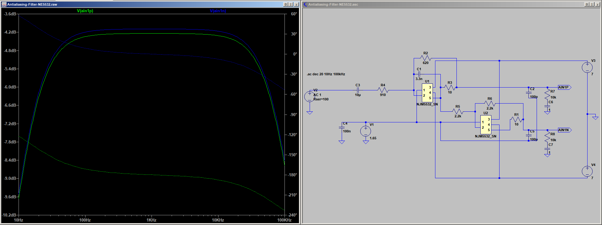
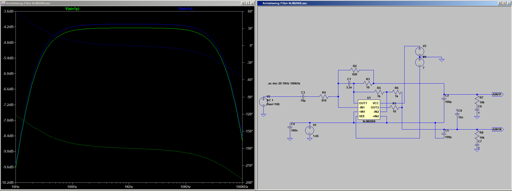

# Filter Design

## AD stage

One of the most critical things in digital audio transmission is the design of the filters before and after the digital transmission line, and with it, the choice of operational amplifiers. (Please be sure to read [Op Amps: Myths & Facts](https://nwavguy.blogspot.com/2011/08/op-amps-myths-facts.html) before reading on!)   

Modern AD converter chips contain a digital decimation filter after the AD converter stage which takes care of aliansing in the audible band, together with 8x or more oversampling. What they cannot take care of, though, is RF noise inserted in the inputs that may lead to frequency mixing with the sample clock and hence to aliasing effects in the audible range. Most vendors therefore recommend to filter the input signal way above the audible range. A simple first order filter is usually sufficient, with a 3dB corner of e.g. 75 kHz. 

I created a simple circuitry and simulated it in LTSpice. The circuit works equally well for popular op-amp types like NJM2068, NE5532 or OPA1679 (I did not test OPA4134 because a) they are quite expensive these days without offering any benefit, and b) their equivalent input noise is higher than the one of the other types). 

In the circuit, the first op-amp constitues a first order lowpass filter at 75 kHz, and the second op-amp simply inverts the signal to accomodate the differential input of the ADC. 

Turned out NJM2068 and NE5532 work equally well but this came as no surprise. Below are the circuits and their passband responses. Top: NE5532, bottom: NJM2068. 

  
  
  
  
The other important aspect is input noise. I used Matlab to calculate the noise behaviour of NE5532, NJM2068, OPA1679 and (utterly expensive but interesting nonetheless) OPA1612. Please make sure to read the TI guideline below to understand the assumptions and the math.
  
The noise figures were calculated with the vendor data for equivalent input voltage and current, and an input resistance of R2 / R4 in parallel. The result: 

| op-amp type ->                     | NJM2068| NE5532| OPA1679| OPA1612|
|------------------------------------|--------|-------|--------|--------|
| input noise voltage (nV/rtHz)      | --     | 5     | 4.5    | 1.1    |
| input noise current (pA/rtHz)      | --     | 0.7   | 0.003  | 1.7    |
| Equivalent Input Noise Voltage (µV)| 0.44   | --    | --     | --     |
| input resistance (Ohm)             | 368.8  | 368.8 | 368.8  | 368.8  |
| resistor noise (nV)                | 2.47   | 2.47  | 2.47   | 2.47   |
| current noise (nV)                 | --     | 45.7  | 0.196  | 11.1   |
| combined noise (µV)                | 0.44   | 0.88  | 0.79   | 0.22   |

The combined noise is on the order of magnitude 21 bits below the maximum input voltage of 1.85 Vpp for the AK5538, so sampling at 24 bits makes sense. 

The OPA1612 appears to be the clear winner but its combined noise is just one bit better than the others, at a much higher price.   
  
So the choice is the NJM2068, also because if it's good enough for Roland, then it should be good enough for us. 

## DA stage 

TBD

## References

  * [AK5538 datasheet](https://www.akm.com/content/dam/documents/products/audio/audio-adc/ak5578en/ak5578en-en-datasheet.pdf)
  * Cirrus Application Note AN-241 [Analog Input Buffer Architectures](https://statics.cirrus.com/pubs/appNote/an241-1.pdf) 
  * Texas Instruments Application Report [Understanding Op Amp Noise in Audio Circuits](https://www.ti.com/lit/ab/sboa345/sboa345.pdf)
  * Tietze, Ulrich; Schenk, Christoph; Gamm, Eberhard: Halbleiter-Schaltungstechnik, 16.Auflage 2019,
ISBN 978-3-662-48553-8

# Copyright and Licensing

The material in this git repository is copyrighted by me and licensed to you by the [GNU General Public License V3](https://www.gnu.org/licenses/gpl-3.0.en.html). Commercial use without written permission is strictly forbidden. If you are interested, feel free to ask for a commercial license. 

