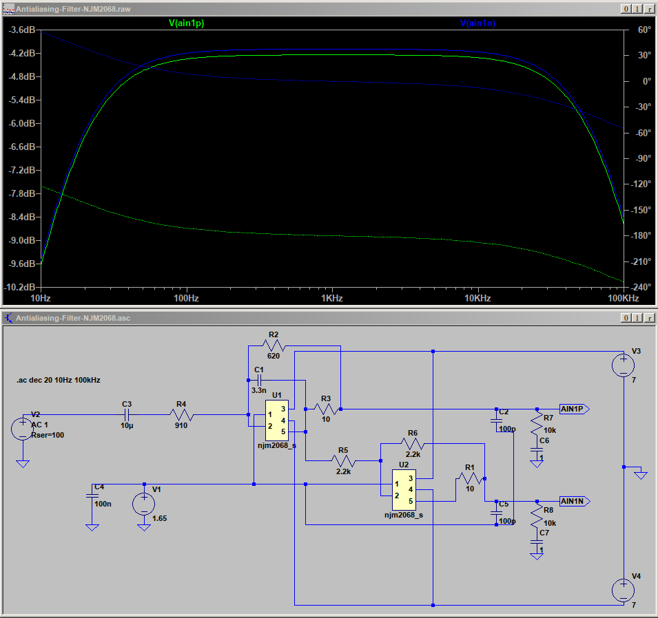

# Filter Design

## AD stage

One of the most critical things in digital audio transmission is the design of the filters before and after the digital transmission line, and with it, the choice of operational amplifiers. (Please be sure to read [Op Amps: Myths & Facts](https://nwavguy.blogspot.com/2011/08/op-amps-myths-facts.html) and  [Op Amp Measurements](https://nwavguy.blogspot.com/2011/08/op-amp-measurements.html) before reading on!)   

Modern AD converter chips contain a digital decimation filter after the AD converter stage which takes care of aliasing in the audible band, together with 8x or more oversampling. What they cannot take care of, though, is RF noise inserted in the inputs that may lead to frequency mixing with the sample clock and hence to aliasing effects in the audible range. Most vendors therefore recommend to filter the input signal way above the audible range. A simple first order filter is usually sufficient, with a 3dB corner of e.g. 75 kHz. The GK-3 has such a filter built in, but it cannot hurt to suppress potential radio interference from the cable at the price of a $0.01 ceramic C0G capacitor. 

I sketched a simple circuitry and simulated it in LTSpice. The circuit works equally well for popular op-amp types like NJM2068, NE5532, NJM4580, or OPA1679. I did not test the OPA4134 because a) the chip is quite expensive these days without offering any benefit, and b) the equivalent input noise is higher than the one of the other types, mainly because FETs have higher flicker noise at low frequencies than bipolar transistors, which means that for low-noise designs, op-amps with FET inputs are mostly out of the game. 

In the circuit, the first op-amp constitutes a first order lowpass filter at 75 kHz, and the second op-amp simply inverts the signal to accomodate the differential input of the ADC. The ADC in turn will be AC coupled using huge 1µF film caps for linearity. The high pass created from the coupling cap and the ADC's input impedance will filter unwanted physical noise below 63 Hz. (see section "Input Channel Configurations" in the TLV320ADC5140 data sheet). 

Turned out NJM2068, NE5532, and NJM4580 work equally well but this came as no surprise. Below is the circuit and the passband response for the NJM2068. The other two are identical. The pin numbering is the one from the Spice models: 1. non-inverting input, 2. inverting input, 3. +Vcc, 4. -Vcc, 5. output. 

  
 
The other important aspect is input noise. I used Matlab to model the noise behaviour of various op-amps. Please be sure to read the TI Application Report about op-amp noise (see References) to understand the assumptions and the math. My general guideline was to make resistor values as small as feasible concerning the load driving capacity of the op-amps. 
  
The noise figures were calculated with the vendor data for equivalent input voltage and current, and an input resistance of R2 / R4 in parallel. The result: 

| op-amp type ->                     | NJM2068 | NE5532 | OPA1679 | OPA1612 | NJM2115 (1) | NJM4580 |
|------------------------------------|---------|--------|---------|---------|---------|-------------|
| input noise voltage (nV/rtHz)      | 4.2      | 5      | 4.5     | 1.1     | --     |  3.3        |
| input noise current (pA/rtHz)      | --      | 0.7    | 0.003   | 1.7     | --      |  --         |
| Equivalent Input Noise Voltage (µV)| 0.44 (2) | --    | --      | --      | ~ 0.48  |  0.8 (3)    |
| input resistance (Ohm)             | 294     | 294    | 294     | 294     | 3408    | 294         |
| resistor noise (nV)                | 2.47    | 2.47   | 2.47    | 2.47    | 7.5     | 2.47        |
| current noise (nV)                 | --      | 45.7   | 0.196   | 111.1   | --      | --          |
| combined noise (µV)                | 0.44    | 0.89   | 0.80    | 0.21    | 0.48 (?) | 0.8        |

 * (1) at the lowest gain stage -- see GR-55 schematics
 * (2) at Rs = 300
 * (3) at Rs = 2.2k

(Update: I'll omit the 10 µF coupling cap at the input and make the input DC coupled, mainly because the signal comes from the GK-2A or GK-3 which are powered from the same power supply and ground. Also, since I need to attenuate the input signal by 18 dB, R4 will be more like 2.7k, and R2 = 330. The op-amp input sees the value of both in parallel, i.e. ~300 Ohms, which make for the combined resistor noise at the input. Likewise in the second stage, the values will be 560 or 680 Ohms.) 

The combined noise is on the order of magnitude 21 or 22 bits below the maximum input voltage swing of the ADC, so sampling at 24 bits makes sense. 

The OPA1612 appears to be the clear winner in numbers but its combined noise in this circuit is just one bit better than the others, at a much higher price. The main reason is the resistor noise which is the same for all simulated circuits. You can try to use a super-duper-low-noise op-amp with awesome data sheet figures of merit, but you cannot avoid the thermal noise from the resistors. Around room temperature, 3 kΩ provides almost one microvolt of RMS noise over 20 kHz (the human hearing range), which is in the same order of magnitude as the combined noise of the naked op-amp itself. Your only chance is to make the resistor values as small as feasible, a) to reduce the thermal noise from the resistors and b) to reduce the noise current contribution at the op-amp input, at the expense of a slightly higher power requirement. (see references below.) Or you can reduce the overall bandwidth by low pass filtering the output but the thermal noise contributes only proportional to its square root. 
 
So the choice is the NJM2068 (which Roland used in the VG-99 input stage, and, by the way, in the GK-3 itself). I would also not mind the NE5532 because it's a known great audio op-amp, but it gives a 1 bit higher noise floor. A good alternative is the NJM4580 which has a similar noise floor but slightly better THD. All three op-amps are pretty close and can be used interchangably in this simple circuit.  (Remark: it is not by pure chance that the NE5532 in particular used to be ubiquitous in pro audio equipment, like mixer consoles, etc., until everyone went digital.)   
  
A slight disadvantage of the NJM2068 and NJM4580 is that Nisshinbo Micro Devices does not specify the input noise current so that you have to rely on the specified combined noise and stick to the quoted combined input resistance. 

(N.B. Roland selected the [NJM2115](https://www.alldatasheet.com/datasheet-pdf/pdf/7259/NJRC/NJM2115.html) for the GR-55 in 2011, and  the NJM2115's equivalent input noise is in the same ballpark as the NE5532's in their circuit, but only in the lowest gain stage. The chip is no longer recommended for new designs though, and I see no reason why I would.)

## DA stage 

The data sheet for the PCM1681 (which is single-ended) proposes a first order lowpass filter at the output to filter out-of-band-noise from the DAC. I'll be using the DC coupled variant, avoiding a potentially non-linear coupling capacitor (section "Analog Outputs" in the PCM1681 data sheet). The next stage (VG-99 or GR-55 input) will low pass filter again, but this is against radio interference.

## References

  * [Op Amps: Myths & Facts](https://nwavguy.blogspot.com/2011/08/op-amps-myths-facts.html)
  * [Op Amp Measurements](https://nwavguy.blogspot.com/2011/08/op-amp-measurements.html) 
  * [Nisshinbo Micro Devices Operational Amplifiers](https://www.nisshinbo-microdevices.co.jp/en/products/operational-amplifier/)
  * [Texas Instruments Audio Op Amps](https://www.ti.com/amplifier-circuit/op-amps/audio/overview.html)
  * Texas Instruments [TLV320ADC5140](https://www.ti.com/product/TLV320ADC5140)
  * Texas Instruments [PCM1681](https://www.ti.com/product/PCM1681)
  * [GR-55 Service Notes](https://www.joness.com/gr300/service/GR-55_SERVICE_NOTES.pdf)
  * [VG-99 Service Manual](https://www.joness.com/gr300/service/VG-99_SERVICE.pdf) (sorry, this is the blurred version that has been circulating the net forever. If someone has a better one... ) 
  * Cirrus Application Note AN-241 [Analog Input Buffer Architectures](https://statics.cirrus.com/pubs/appNote/an241-1.pdf) 
  * Texas Instruments Analog Design Journal [Selecting capacitors to minimize distortion in audio applications (Rev. A)](https://www.ti.com/lit/pdf/slyt796)
  * Texas Instruments Application Report [Understanding Op Amp Noise in Audio Circuits](https://www.ti.com/lit/ab/sboa345/sboa345.pdf)
  * [Friis formulas for noise](https://en.wikipedia.org/wiki/Friis_formulas_for_noise)
  * [Noise of ideal resistors for moderate frequencies](https://en.wikipedia.org/wiki/Johnson%E2%80%93Nyquist_noise#Noise_of_ideal_resistors_for_moderate_frequencies)
  * Tietze, Ulrich; Schenk, Christoph; Gamm, Eberhard: Halbleiter-Schaltungstechnik, 16.Auflage 2019,
ISBN 978-3-662-48553-8

# Copyright and Licensing

The material in this git repository is copyrighted by me and licensed to you by the [GNU General Public License V3](https://www.gnu.org/licenses/gpl-3.0.en.html). Commercial use without written permission is strictly forbidden. If you are interested, feel free to ask for a commercial license. 

