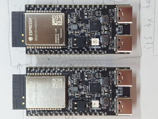

# Progress 

2025-01-10

 * the two boards now talk exclusively 11AX with WPA3-SAE in 5 GHz. According to iperf, the UDP data rate with a payload of 1440 bytes is around 63 MBit/s. YAY! 

`    I (4195) wifi:security: WPA3-SAE, phy:11ax, rssi:-29, cipher(pairwise:0x3, group:0x3), pmf:1, 
`
 * OK, I think it's time for another latency measurement because that's now on a different platform. 
 
2025-01-09

 * Rx setup done, AP works
 * strangely, Rx and Tx negotiate only 11AN at HT20. Needs further invesigation. 
 * testing Rx strategies - should UDP packet reception time the thing, or the DMA on_sent event? 

2025-01-07

 * Hooray! The C5 DevKits arrived! 
 * First tests are very promising. The device running at 160 or 240 MHz connects to my FritzBox using 5 GHz Wifi6 11AX just fine (well, most of the time - sometimes the AP offers only 11AC), and if it does, I see no ENOMEM induced packet losses with 8 slots at all. So I've got to figure out how to force the pair to always negotiate 11AX. I'll have it run overnight to see if it's stable over hours, and next is getting the receiver to work as Wifi6 11AX AP with WPA3. 
 * If it connects with 11AX, it's WIFI_PHY_RATE_MCS7_SGI in HT20 mode (the FritzBox says 81 MBit/s), and it authorizes using WPA3-SAE. I don't think it can get any better than that :-) . (Too bad the chip does not support HT40 with 11AX or 11AC but that's not relevant for this application.) 

2025-01-06

 * code split
 * rewrite of STA setup, new AP setup, new UDP_RX task

2025-01-05

 * overnight, the sender protoype has sent ~ 17 GB of (artificial) data to my Linux machine without any major problem. I still see occasional packet losses due to ENOMEM errors caused by UDP sendto(). The root cause is not a general lack of RAM by the way - the largest free block on the heap is constantly ~ 286k of 512k. With the C5 that has PSRAM, I need to make the LWIP buffers static anyway - we will see. 
 * when sending a continuous stream, the C6 pulls about 110-120 mA. The C5 will likely need a bit more due to the higher clock frequency. 

2025-01-04

 * Wifi6 with HT20 / MCS7_SGI works. The FritzBox reports the device as connected with 81 MBit/s. 
 * WPA2/PSK with my FritzBox works. WPA3/PSK preferred but that seems not to work. No prio #1 task for now.
 * sending 2 or 4 channels over UDP to Linux works in principle but I fight with ENOMEM errors from the LWIP stack, losing packets due to socket restart. 

2025-01-03

 * working sender prototype for 4 or 8 channels, still without ADC or UDP, but that's next. 

2024-12-29

 * time measurement; buffer compression 32 -> 24 bit, to compare 2 potential algorithms

2ß24-12-28

 * rearranged git repo and added ESP-IDF master branch for ESP32-C5 preview

2024-12-26

 * ordered ESP32-C5 DevKit early samples from Espressif :-) They are supposed to arrived at the end of Jan 2025. 

2024-05-24

 * C6 boards arrived, first benchmarks measuring simple math performance in comparison to S2 and S3. 

2024-05-21

 * code stub for I2S setup and LRCK interrupt handling; measured interrupt latency

2024-05-20

 * code stubs for MD5 / SHA1 / SHA256 HMAC generation incl. time measurement; buffer compression 32 -> 24 bit

2024-05-19

 * code stubs for Wifi AP & web configuration UI 

2024-05-16

 * ADC and DAC breakouts arrived. 

2024-05-13

 * ADC input filter design done and documented. 

2024-05-05

 * ordered two ESP32-C6 DevKits, a TI PCM1808 ADC and a TI PCM5102 DAC breakout board each.

